# Stock-Management-System
This repo contains SMS Using PHP and MYSQL this project is above CRUD (Create Read Update Delete) and have Some Analytics part with Verification and Validation

# APPENDICES
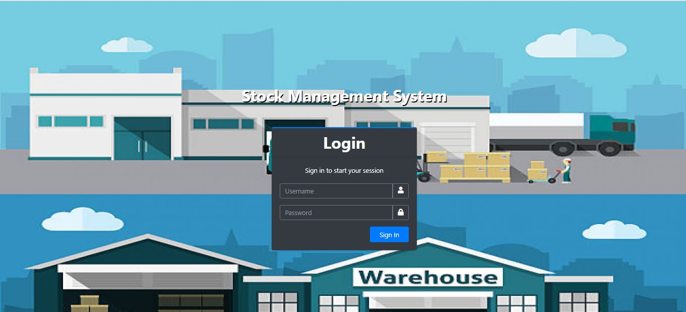

***Fig: Login Page***
> 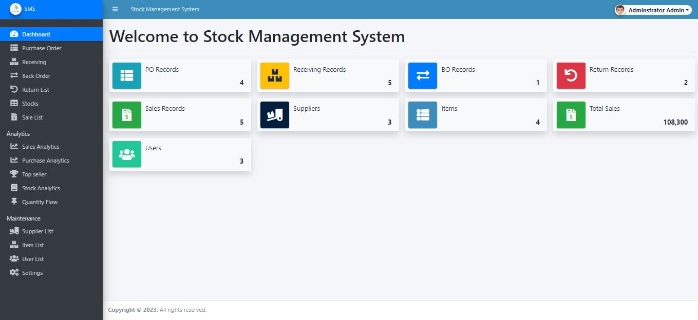 style="width:6.26806in;height:2.87778in" />
>
***Fig: Admin Home Page***

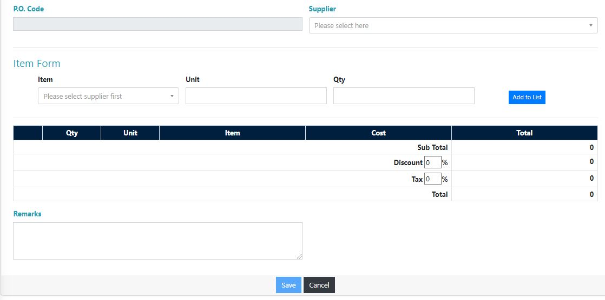

***Fig: Create Purchase Order Page***

> 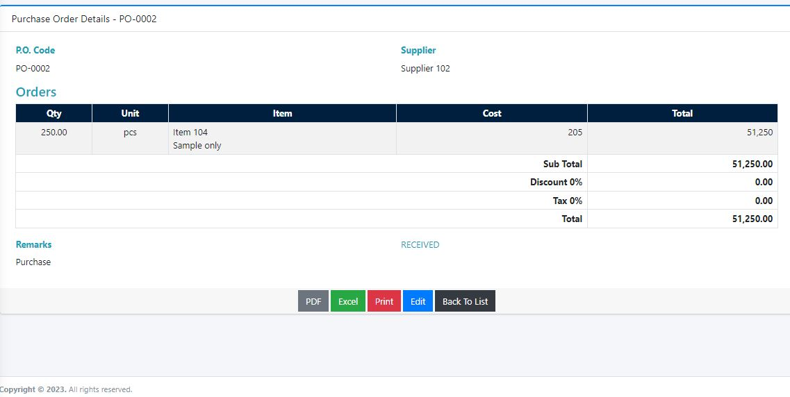 style="width:6.26806in;height:3.15347in" /> 

***Fig: View PurchaseOrder Page***
>
> 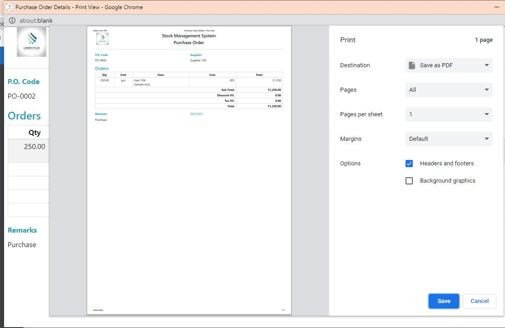 style="width:6.26806in;height:4.06944in" />
>
***Fig: View Purchase Order Print Page***

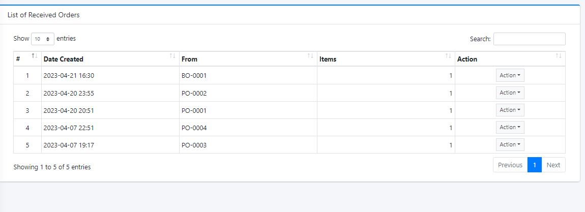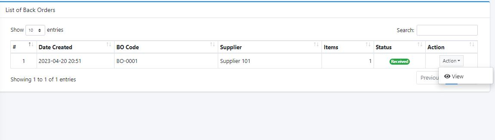 

***Fig: Received Order Page***

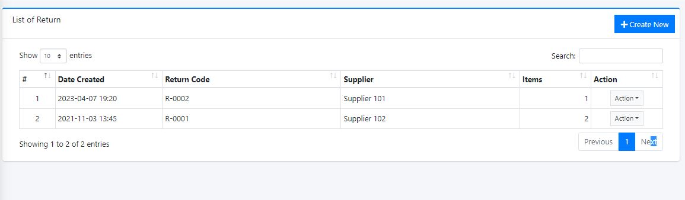 

***Fig: List of Return Order Page***

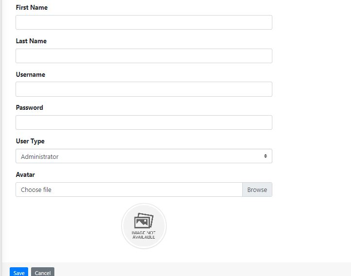

***Fig: Edit Admin Page***

# CHAPTER 1: INTRODUCTION 

## **1.1 Introduction** 

Stock Management is the practice of ordering, storing, tracking, and
controlling inventory Stock Management applies to every item a business
uses to produce its products or services from raw materials to finished
goods. In other words, stock management covers every aspect of a
business’s inventory. Stock Management System helps in the efficient
monitoring of constant flow of units into and out of an existing
inventory. This process usually involves controlling the transfer in of
units in order to prevent the inventory from becoming too high, or to
low so that the operation of the company into difficulties 

Stock Management System is very important organizations especially where
there are a lot of orders are being placed every day and there are lot
of materials and the maintenance is really important which the system
will do and also will record the time taken to process an order and this
system is really important as it can help the organizations to be
alerted when the level of inventory is very low and focuses on the three
aspects of inventory management and prevent from failures in the future.

Stock Management System also demands a solid understanding of how long
it will take for those materials to transfer out of the inventory to be
established. By Knowing these two important lead key aspects makes it
possible to know when to place an order and how many units must be
ordered to keep production running smoothly.

The two common inventory-management strategies are the just-in-time
method, where the companies plan to receive items as they are needed
rather than maintaining high inventory levels, and materials requirement
planning strategy, which schedules material deliveries based on sales
forecasts 

Nowadays, many companies use the system to avoid overstock, miscount and
outages. It is a system for organizing a better inventory data than that
was used before which is generally stored in manual form books or in
spreadsheets. This application has admin component to manage the
inventory and maintenance of the inventory system. This System has
general organization profile, stock details, purchase details and the
remaining stock that are presented in the organization. This System also
provides the remaining balance of the stock as well as the details of
the balance of transaction. Each new stock is created and entitled with
the named and the entry date of that stock and it can also be update any
time when required as per the transaction or the sales is returned in
case. Here the login page is created to protect the management of the
stock of organization in order to prevent it from the threads and misuse
of the inventory. This management system can be used by staffs that can
enables the user to view the product and item information that have been
key-in. Staff or user can update any other information directly by using
online system just like any other online systems 

The added valued contain in this system is Product Calculation Method
(PCM) which it can be used by staffs to key-in any item that company
bought or item in store to make sure the actual amount of that item or
product. This method will make the calculation before the item stored
and give a recommending about the place that item should be stored. This
method can help staffs to move the item easily when they know the actual
places to keep the item 

Now a day’s people lives in a modern era. They made everything according
to their needs. They tried all the possible way to make their life easy
and comfortable. Stock house or warehouse is a very common term right
now. People stores their needed thing for different purpose. It is a
very toughest thing to manage stock in proper way. After that people
manage their stock in analogue way. Their stock management was paper or
oral based.

After fully development of this system, system should be able to setup
category, product under category, supplier and customer. It should be
able to purchase product and sale product and required functionalities
under purchase and sale module. After development admin can get stock
current status, report on sale and purchase. There is only one admin in
this system. Only admin can create user. All the types of functional and
non-functional requirements will be implemented for this system. The
system has total various modules. Here first of all admin need to setup
category and setup product under category. Then he need to setup
supplier and customer from where the organization buy products and to
whom they sell their product. When admin setup products he can set
reorder level against individual product. There also purchase and sale
module. Admin can store all the information about purchase. Such as
which kind of products they bought, total products, product MRP etc.
Admin can also store sale information. He can check stock, Number of
sold product, number of stored product etc. there also report module in
this system where admin can check report of purchase and sale. He can
also get statistics about total sales.

## **1.2 Problem Statement**

The main problem that occurs in several companies or retailers is the
lack of an efficient system to calculate and manage their stock levels.
Through my analysis, I have discovered that some companies still rely on
paper-based or manual filing systems to store information about their
stocks. This manual approach requires a significant amount of time and
effort from administrators or managers to trace product status and
details. Additionally, it can result in inventory inaccuracies if
workers forget to update the inventory manually or make mistakes during
the manual counting process.

The Stock Management System will effectively address these issues by
storing all inventory related information in a database. This will make
it much easier to manage and update stock data, saving time and reducing
costs for the organization. The system will automate various
inventory-related tasks and provide a centralized platform for tracking
purchases, sales, returns, and available stock levels. Furthermore, it
will calculate costs, including taxes and discounts, accurately and
efficiently.

Stock Management System will provide all the information needed and
required for inventory related in understanding in easy way and that
will reduce the time taken for the inventory manager to record all the
products that are in inventory which takes too much time. This will help
to list out all the details using the system or search all the inventory
information.

## **1.3 Objective** 

1\. To design and develop a user-friendly system that effectively
handles and manages information about items or products, while also
providing calculations for the information system.

2\. To develop a system that deals with the day-to-day needs of
organization like managing purchase, sales, return, and available
stocks.

3\. Keep each and every calculation and help to generate reports of
transactions in Excel, PDF format.

4\. Additionally, the system should provide a seamless printing feature
for generating reports of various transactions, including purchase,
sales, and returns.

## **1.4 Scope and Limitations**

## **1.4.1 Scope** 

A stock management system is designed to help businesses efficiently
track and manage their inventory levels. The scope of this system
includes:

1.  All authorized users with proper access credentials can use this
    system to manage Stock.

2.  The system allows users to easily input, track, and update stock
    levels.

3.  The system offers comprehensive reports and analytics, enabling
    users to make well-informed decisions regarding purchasing and Stock
    management.

4.  The system accurately calculates and maintains records of
    transactions, facilitating the generation of reports in Excel and
    PDF formats. This feature ensures that users have access to detailed
    transactional information.

5.  The system accurately calculates and maintains records of
    transactions, facilitating the generation of reports in Excel and
    PDF formats. This feature ensures that users have access to detailed
    transactional information.

## **1.4.2 Limitations**

While a stock management system can provide many benefits to businesses,
there are also some limitations to consider. These include:

1.  The accuracy of inventory levels depends on the accuracy of data
    input by users.

2.  The system may not be able to integrate with all other business
    software, depending on compatibility.

3.  The system's functionality may vary depending on the specific
    industry or type of business.

4.  The system may have limited functionality for certain industries or
    types of businesses.

5.  The system has limited amount of category.

## **1.5 Report Organization**

This report document contains five chapters including this chapter.

Chapter 1: Describes Introduction of the project, Problem statement,
Objective, Scope and Limitation of the project.

Chapter 2: Describes Background Study and Overview of related existing
systems.

Chapter 3: Describes System Analysis, Requirement Analysis, and Design
including Use Case Diagram, Gantt chart, Entity Relationship Diagram and
Dataflow Diagram.

Chapter 4: Presents the Implementation, Testing and debugging are
explained.

Chapter 5: Presents the Conclusion on Limitations and Future Enhancement
are briefly explained.

# CHAPTER 2: BACKGROUND STUDY AND LITERATURE REVIEW

## 

## **2.1 Background Study**

In today's world the use and access to the internet is so high so most
of the people are busy on their own work so we have developed this
module so that user can create and access to their account through the
use of internet and general concept and terminologies are mentioned
below.

1.  User Interface: The system should have a user-friendly interface
    that allows users to easily navigate through the system and perform
    various actions such as adding or editing stock items, generating
    reports, and managing inventory levels.

2.  Dashboard: The system should have a dashboard that provides a quick
    overview of stock levels, sales trends, and other important metrics.

3.  Stock Tracking: The system should be able to track stock levels for
    each item, including current stock levels, incoming stock, and
    outgoing stock.

4.  Purchase Order Management: The system should allow users to create
    and manage purchase orders for stock items, including tracking the
    status of each order.

5.  Sales Order Management: The system should allow users to create and
    manage sales orders for stock items, including tracking the status
    of each order.

6.  Reporting: The system should provide a range of reports, including
    stock levels, sales trends, and inventory turnover, to help users
    make informed decisions.

7.  Integration: The system should be able to integrate with other
    systems such as accounting software and e-commerce platforms, to
    streamline business processes.

8.  Security: The system should have robust security measures in place
    to protect sensitive data such as stock levels, purchase orders, and
    sales orders. This may include user authentication, data encryption,
    and role-based access control.

9.  Scalability: The system should be scalable to meet the needs of
    growing businesses, with the ability to handle larger volumes of
    stock.

## **2.2 Literature Review**

A study of an existing system for stock management involves analyzing
the current system that a business is using to manage its inventory. The
purpose of this study is to identify any weaknesses in the current
system and suggest improvements that can be made to enhance the
efficiency and accuracy of stock management. The study may involve
analyzing various aspects of the current system, such as the user
interface, the stock tracking mechanism, the purchase order and sales
order management, and the reporting capabilities.

During the study, it is essential to gather feedback from the users of
the current system to identify any pain points they are experiencing.
This can be achieved through surveys, interviews, and observations of
the users in action. The feedback gathered can provide valuable insights
into the current system's strengths and weaknesses and can be used to
inform the development of a new system or the improvement of the
existing one.

The study may also involve analyzing the data generated by the current
system to identify patterns and trends in stock levels, sales, and
inventory turnover. This data can be used to optimize the stock
management process by identifying areas where improvements can be made,
such as reducing excess stock or improving order fulfillment times.

Ultimately, the goal of studying an existing system for stock management
is to identify opportunities for improvement that can help the business
run more efficiently and effectively. By gathering feedback from users,
analyzing data, and identifying pain points, businesses can develop a
better understanding of their stock management needs and create a new
system or improve the existing one that meets those needs.

After conducting research on existing stock management systems, we have
identified a system called TradeGecko that provides a comprehensive
solution for managing inventory, sales, and purchasing. TradeGecko
offers a cloud-based platform that allows users to manage their stock
levels in real-time, track orders and shipments, and generate reports on
inventory performance.

The TradeGecko system includes features such as inventory tracking,
order management, purchase orders, sales orders, and reporting. It also
integrates with popular e-commerce platforms, accounting software, and
shipping providers, making it a versatile solution for businesses of all
sizes 

One of the key benefits of TradeGecko is its user-friendly interface,
which makes it easy for users to navigate the system and perform various
actions such as adding or editing stock items, generating reports, and
managing inventory levels which allows users to easily add and update
stock items, making stocktaking and stock tracking more accurate and
efficient.

TradeGecko also offers a range of reporting features, including stock
levels, sales trends, and inventory turnover, which provide valuable
insights into business performance. The system is scalable and can
handle large volumes of stock items, purchase orders, and sales orders,
making it suitable for businesses that are growing rapidly.

SAP ERP Inventory Management: SAP ERP is a comprehensive enterprise
resource planning system that includes inventory management
functionality. This system allows businesses to track inventory levels,
monitor product movement, and optimize replenishment processes. SAP ERP
also includes features for managing warehouse operations, such as
picking, packing, and shipping

QuickBooks Online Inventory Management: QuickBooks Online is a
cloud-based accounting and inventory management system designed for
small and medium-sized businesses. This system allows businesses to
track inventory levels, create purchase orders, and manage sales orders.
QuickBooks Online also includes features for managing customers,
vendors, and financial transactions 

Zoho Inventory: Zoho Inventory is a cloud-based inventory management
system that allows businesses to track inventory levels across multiple
channels, including e-commerce platforms and third-party marketplaces.
This system also includes features for managing purchase orders, sales
orders, and shipping operations. Zoho Inventory integrates with other
Zoho applications, such as Zoho CRM and Zoho Books 

Fishbowl Inventory: Fishbowl Inventory is an inventory management system
designed for small and mid-sized businesses. This system includes
features for managing inventory levels, tracking product movement, and
generating reports. Fishbowl Inventory also includes features for
managing manufacturing operations, such as bill of materials and work
orders 

Literature review is the formal methods that can be used to review the
critical points of current knowledge including findings as well as
theoretical and methodological particular topic for supporting issues.
Products are considered as the business resources for the organization.
This includes managing the product with appropriate way to review any
time as per the requirement. Therefore it is important to have a
computer based which has the ability to generate reports, maintain the
balance of the stock, details about the purchase and sales in the
organization. Before developing this application we came up with several
Inventory Management System existing in the market, which helps to give
the knowledge for the development of this project. These application
software are only used by the large organization but so we came up with
the application which can be used by the small company for the
management of their stock in the production houses. After analysing the
other inventory management system we decided to include some of common
and key features that should be included in every inventory management
system. So we decided to include those things that help the small
organization to adapt with this application 

Stock management systems have become increasingly important in the
modern business landscape, especially with the rise of e-commerce and
online retail. Such systems help businesses keep track of their
inventory levels, monitor product movement, and ensure that they always
have enough stock on hand to meet customer demand. In this literature
review, we will examine some of the key research studies and articles
that have been published on stock management systems.

One study that explored the importance of stock management systems was
conducted by Saravanan. The study examined the impact of a stock
management system on the operational efficiency of a retail store. The
results of the study showed that the use of a stock management system
significantly improved the store's inventory accuracy, reduced
stockouts, and increased the store's overall profitability 

Another study by Wang et al explored the use of a real-time stock
management system in the manufacturing industry. The study found that
the system helped reduce excess inventory levels, improve product
quality, and increase production efficiency 

In a similar study, Parvez and Kabir examined the impact of a stock
management system on supply chain performance. The results of the study
showed that the use of a stock management system helped reduce inventory
holding costs, minimize stockouts, and improve order fulfillment rates

A more recent study by Jeevitha et al explored the use of a stock
management system in the healthcare industry. The study found that the
system helped reduce waste and spoilage, improve inventory accuracy, and
increase the efficiency of medical supply management 

In addition to these research studies, there are many articles and
reports available that provide insights into the best practices for
stock management systems. For example, the Harvard Business Review
published an article by Lee and Billington that provided a framework for
improving supply chain management, including stock management. The
article emphasized the importance of data analytics, collaboration
between suppliers and customers, and the use of technology to improve
inventory visibility 

Overall, the literature suggests that stock management systems can
provide significant benefits to businesses across a wide range of
industries. By improving inventory accuracy, reducing stockouts, and
increasing operational efficiency, these systems can help businesses
meet customer demand while minimizing costs and maximizing
profitability.

In addition to the studies and articles mentioned above, there are also
some key trends and developments in the field of stock management
systems that are worth considering.

One trend is the increasing use of artificial intelligence (AI) and
machine learning (ML) in stock management systems. AI and ML can be used
to analyze large amounts of data and identify patterns and trends that
can help businesses make more informed decisions about inventory
management. For example, AI and ML can be used to predict demand for
certain products based on historical sales data, seasonal trends, and
other factors. This can help businesses optimize their inventory levels
and reduce waste and excess inventory 

Another trend is the move towards cloud-based stock management systems.
Cloud-based systems offer several benefits over traditional on-premise
systems, including lower upfront costs, greater scalability, and easier
access to real-time data. With a cloud-based system, businesses can
access their inventory data from anywhere and at any time, which can be
particularly useful for companies with multiple locations or remote
workers. There is also a growing interest in sustainable stock
management systems that prioritize environmental and social
responsibility. This includes reducing waste and excess inventory, using
environmentally-friendly packaging materials, and sourcing products from
ethical and sustainable suppliers 

There is a recognition that stock management systems must be integrated
with other systems and processes within a business in order to be truly
effective. This includes integrating with accounting systems, order
management systems, and logistics systems, among others. By integrating
these systems, businesses can achieve greater visibility and control
over their entire supply chain, from raw materials to finished products.

In addition to the trends and developments in stock management systems,
there are also some challenges that businesses may face when
implementing these systems. One challenge is the need to balance
inventory levels with customer demand. Businesses need to ensure that
they have enough inventory on hand to meet customer demand, while also
avoiding excess inventory that can lead to waste and higher holding
costs.

Another challenge is the complexity of managing inventory across
multiple channels, such as brick-and-mortar stores, e-commerce
platforms, and third-party marketplaces. Businesses need to ensure that
their inventory levels are consistent across all channels, while also
taking into account differences in customer demand and fulfillment
capabilities 

To overcome these challenges, businesses can implement best practices
such as demand forecasting, safety stock planning, and continuous
inventory tracking. They can also invest in inventory management
software that offers real-time tracking and analytics capabilities. By
taking a strategic approach to inventory management and leveraging the
latest technologies and best practices, businesses can optimize their
inventory levels and maximize their overall operational efficiency and
profitability 

In summary, the field of stock management systems is constantly
evolving, with new technologies, trends, and best practices emerging all
the time. By staying up-to-date on these developments and implementing
the most effective strategies and systems, businesses can optimize their
inventory management and improve their overall operational efficiency
and profitability.

# CHAPTER 3: SYSTEM ANALYSIS AND DESIGN

## **3.1 System Analysis**

A system development methodology in software engineering is the main
guidance for constructing, planning and also controlling the process of
developing an information system. Common methodologies used were
waterfall model, prototyping, spiral development, extreme programming
and also some other various types of methodologies.

Considering the fact that this project involves design and
implementation of a software system regardless that is web-based, it
will be important to mention and consider some models used in software
development and deployment, some general models of software development
are namely waterfall model, prototyping, spiral development, extreme
programming and also some other various types of methodologies.

**The waterfall model** fits the development of this website. The main
aim of using this approach is we can focus on each part of the model
during development and come back to it if need be. The project can
easily de broken down into different parts based on this model. This is
the model that will be used to develop the Stock Management System However, feedback loops will be allowed during the whole software development process. The model chosen for this project has to favours two developers for a project. Because we are the only ones who are going to implement this project. We find this model suitable for us to follow.

It requires that software development follows the following stages:

- Requirements are to be proposed.

- System design should be made according to the requirements.

- Implementation of the features according to the design.

- Integration and testing of the system.

- Deployment of the system.

- Maintenance of the system.

Waterfall methodology is used while building this website. This project
has specific documentation, fixed time, fixed requirements, and
well-understanding technology so in order to build this system waterfall
methodology can be properly utilized.

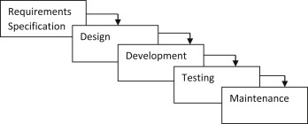

***Fig 3.1: Waterfall model***

1.  Requirements Analysis: In the first phase of the waterfall model,
    the requirements for the stock management system are gathered from
    stakeholders such as business owners, managers, and users. This
    involves defining the features, functionalities, and scope of the
    system.

2.  Design: In the second phase, the requirements gathered in the first
    phase are used to design the system. This includes creating a
    detailed system design document that outlines the system
    architecture, database schema, user interface design, and system
    workflows.

3.  Deployment: In the fifth phase, the stock management system is
    deployed to the production environment. This involves installing the
    system on the production servers, configuring the system for the
    production environment, and performing any necessary data
    migration..

4.  Testing: In the fourth phase, the stock management system is
    thoroughly tested to ensure that it meets the requirements outlined
    in the first phase. This includes unit testing, integration testing,
    system testing, and user acceptance testing.

5.  Maintenance: In the final phase, the stock management system is
    maintained and updated as necessary to ensure that it continues to
    meet the needs of the business. This includes bug fixes, system
    updates, and new feature development

## **3.1.1 Requirements**

Requirement analysis is done so that the project gets the necessary
features and will be easy for analysing system. Requirement analysis is
an important phase in developing a stock management system, as it helps
to ensure that the system meets the needs and expectations of the
business It is a key instrument used to determine the needs and
expectations of a new product. In this project requirements are
categorized into two parts i.e. functional requirements and
non-functional requirements.

For any system, there are functional and non-functional requirements to
be considered while determining the requirements of the System.

**I. Functional requirement:** In this project the functional
requirements are categorized into two different models i.e., Staff
Module and Admin Module. Under Staff Model user can easily use the
features like login, viewing products managing products, receiving
products. Whereas Admin Module consists of using the system as an
administrative which consists of features like managing products,
managing users, managing suppler and viewing orders and printing orders
and exporting data into excel or PDF. The Functional requirements in the
project are mentioned below.

**User** **Module:**

- User shall login the system.

- User shall Manage Purchase, Sales, and Return Orders.

- User shall printing Purchase, Sales, Return Orders and Exporting data
  into excel or PDF.

- User shall View Back Order.

- User shall view available Stocks.

**Admin Module:**

- Admin shall login the system.

<!-- -->

- Admin shall Manage Purchase, Sales, and Return Orders.

<!-- -->

- Admin shall see the registered users and create the user.

- Admin shall delete the user.

- Admin shall view available Stocks.

- Admin shall printing Purchase, Sales, Return Orders and Exporting data
  into excel or PDF

- Admin shall printing Purchase, Sales, Return Orders and Exporting data
  into excel or PDF.

- Admin shall manage supplier.

- Admin shall manage Item list.

**3.1.2 Use Case Diagram**

A use case diagram is used in this project which will help to understand
the dynamics of a system, we need to use different types of diagrams.
Use case diagram is one of them and its specific purpose is to gather
system requirements and actors a graphic depiction of interactions among
different elements in a system. A use case diagram for a stock
management system would include actors, use cases, and the system
boundary. The actors in this system would be the Admin and the User. The
use cases would include, Login, Create Edit View Purchase Order, Approve
Purchase Order, View Back Order, and Create Edit View Sales order,
Export the Report in PDF, Excel Format, and use Print also. Remaining
Stock with the proper validation in the data. View of Analytics which
will cover the chart like bar chart, Radar chart and line chart of
various Properties and the action. Admin can only be able to manage the
Item list, Supplier List, and User list and will also be able to manage
the user and create the user from Admin panel.

The system boundary would be represented by a rectangle box, and the
Include and Extend relationships would indicate necessary and optional
features, respectively.

By using a use case diagram, the stock management system can be
visualized and designed to meet the needs of both the Admin and User
actors, ensuring that the system is efficient and user-friendly.

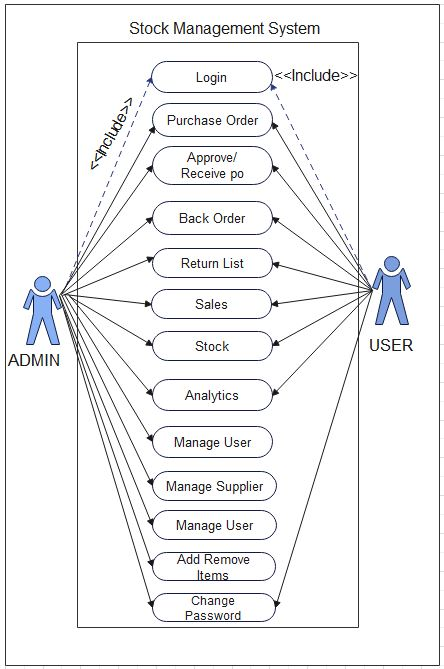

***Fig 3.1.2: Use case diagram of Stock Management System***

**II. Non-functional requirements:** They are an important aspect of
developing a stock management system as they focus on the systems
overall performance and usability. Here are some key non-functional
requirements that should be considered during the development of a stock
management system

- Performance: The system should be designed to handle large amounts of
  data and transactions with minimal response time. It should be able to
  process multiple user requests simultaneously without affecting system
  performance.

- Reliability: The system should be reliable and available at all times.
  It should be able to recover from any failures or crashes without
  losing data or disrupting business operations.

- Security: The system should be secure and protect sensitive inventory
  and customer data. It should be designed to prevent unauthorized
  access, data breaches, and other security threats.

- Usability: The system should be user-friendly and easy to use, with a
  well-designed user interface and clear navigation. It should be able
  to support multiple languages and be accessible to users with
  disabilities.

- Scalability: The system should be able to scale to handle increased
  data volumes, users, and transactions as the business grows. It should
  be designed to handle future expansion without significant system
  redesign.

- Maintainability: The system should be easy to maintain and update,
  with minimal downtime and disruptions to business operations. It
  should be designed with modular architecture and well-documented code
  to facilitate future updates and enhancements.

## **3.1.3 Feasibility study**

A feasibility study is an evaluation and analysis of a project or system
that somebody has proposed. Following feasibilities were studied before
building the system to see if the system could be built with exact
requirements in required time.

**I. Technical Feasibility**

In order to design this system, it uses existing technologies, software
and hardware so there is no technological hurdle to build this system.

- The UI of our project is very simple

- User will require internet browser and internet to use it

- It will run on many existing web browsers with the latest versions and
  even in the smart phones.

**Tools and Technology Used:**

The Following software is used for the development of the System.

- VS Code

- MySQL

- Apache [Xampp]

- Minimum Windows 8 required.

**II. Economic Feasibility**

Before the development of a system, the proposed system should be
studied whether or not it is within the budget estimated by the
organization. The project that we are developing is within the cost
estimation of the organization. The project cost is less and no more
burdens are needed. The system development does not have any requirement
of expensive hardware and software. The platform are open sources and
the resources required for the project are also open source. Hence the
project is said to be economically feasibility

**III. Operational Feasibility**

These include the reliability, maintainability, usability,
supportability. The proposed system is operationally feasible as it is
reliable for all type of user i.e., whether or not the user has the
knowledge of computer or not. The proposed system is supported for a
small to large-scale organization. It is simple and easy to use due to
simple user interface and its operational feasible.

**IV. Schedule Feasibility**

The system that we developed is scheduling feasible as it does not
require more time for the development phase. The data collection takes
more time to collect the data about various products and their quality.
After data is collected, the other development phase can be within a
month. Gantt charts: Gantt chart is a bar chart that provides a visual
view of tasks scheduled over time. A Gantt chart is used for planning
projects of all sizes, and it is a useful way of showing what work is
scheduled to be done on a specific day- It can also help you view the
start and end dates of a project in one simple chart. In our project, we
used Ms. Excel for developing the Gantt chart which is shown below in
the figure.

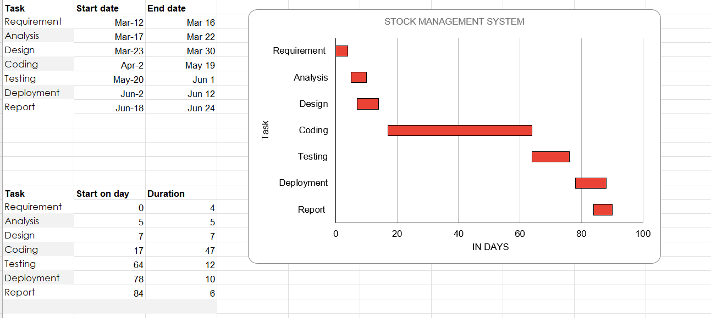

***Fig 3.1.3: Gantt chart of Stock Management System.***

## **3.1.4 Entity Relationship Diagram (ERD)** 

An ERD for a stock management system would include entities, attributes, and relationships. The entities in this system would be Login, User, Admin, Purchase_Order, Receiving, Supplier, Sales and Return Lists. The attributes and relationships would include, Registration this entity would include attributes such as Username, and Password would be the primary key for this entity. The Registration entity would have a one-to-many relationship with the User entity, as one user can have only one registration, but a registration can be associated with multiple users. User this entity would include attributes such as User id, Username, and Password. User id would be the primary key for this entity. The User entity would have a many-to-one relationship with the Admin entity, as many users can be associated with one admin. Admin this entity would include attributes such as Admin id, Name, and Password. Admin id would be the primary key for this entity. The Admin entity would have a privilege to manage the users. Items this entity would include attributes such as item id, Item name, Price and Quantity. The Products entity would have a one-to-many relationship with the User entity, as one user can order many products. Purchase Order Entity will have Date Created as a Primary key, Po_id as a primary key and Po_code as primary, price and quantity will be derive entity as it is dependent with items table and the data will come from that table and vice versa. After the issue of purchase it should be received and the received items will shift towards the Stock and if received it will move towards back Order. Supplier entity will have Supplier id and item id as a primary key and supplier price will be a derived attributes, and other vice versa. Stock will be a week entity as it will be derived from purchase and sales entity and will have Po code and sales code as a primary key and will use In and Out for the calculation of remaining stocks while having quantity as a derived attribute. Return list will also be an week entity and be derived from purchase and sales entity and will have Po code and sales code as a primary key and quantity as a derived attribute.

The ERD would help in designing a well-structured database for the stock
management system, and ensure that the database is efficient and can
handle a large amount of data. By analysing the database through the
ERD, any potential issues or conflicts can be resolved beforehand,
ensuring a smooth implementation of the stock management system.

> 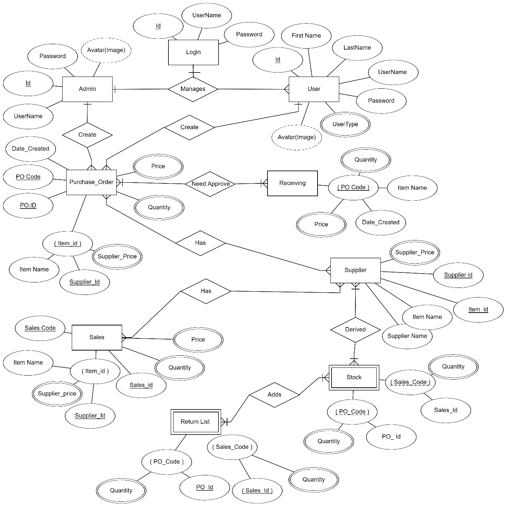 style="width:6.26806in;height:6.26181in" />
 
***Fig 3.1.4: Entity Relationship Diagram for StockManagement System.***

## **3.1.5 Process Modelling (DFD)**

Data Flow Diagram (DFD) is used in this project as it helps to
represents the information flow for any process or system. It shows data
inputs, outputs, storage points, and the routes between each destination
using defined symbols such as rectangles, circles, and arrows, as well
as short text labels. DFD are classified into three model i.e., level 0,
level 1, and level 2. Each update in level consists of expanding the
model.

## **3.1.6 Data Flow Diagram Level 0** 

The Level 0 DFD Diagram for Stock Management System Website contains the
basic yet general process of the system. Its purpose is to give the
system analyst and programmers the basis for further process. The reason
why the DFD Level were done one-by-one is to see and avoid flaws while
still designing the diagram.

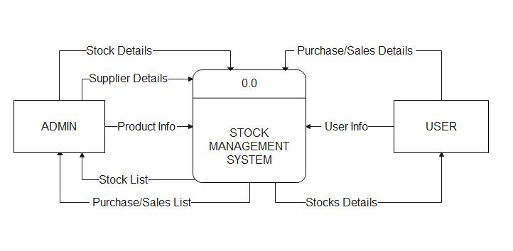

***Fig 3.1.6: DFD Diagram (level 0 DFD) for Stock Management System***

DFD Level 0 presents the main
idea to be the basis for the proceeding levels. The basic idea is
represented by a single process consisting the main process, users and
data. As we can see from the diagram the DFD Level 0 represents Stock
Management System, Admin, and User. Admin Send Product info, Stock
Details and Suppliers Details to the Stock Management System and
receives Stocks List, Purchase and Sales list form the Stock Management
System. Where User sends User info and Purchase and sales details and
also gets the stock details from the Stock Management System In addition
to this, you will perceive through the diagram that there is already the
presence of data flow. Though the process is very general, the flow of
data is clear. Nevertheless,

## **3.1.7 Data Flow Diagram Level 1** 

The DFD Level 1 Diagram for Stock Management System provides a broad
overview and greater depth of DFD Level 0. The single process node from
the context diagram is broken down into sub processes to see the
included data that may enter and exits system.

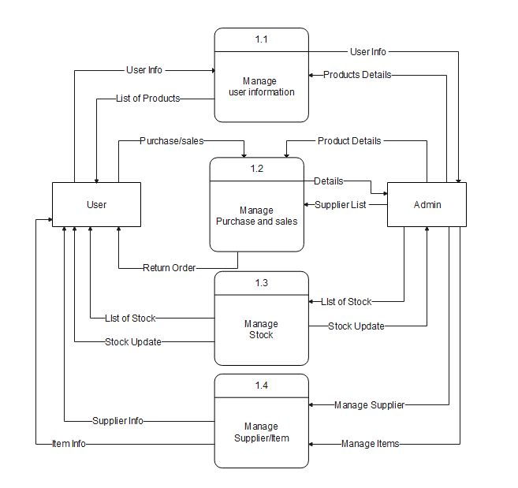

***Fig 3.1.7: DFD Diagram (level 1 DFD) for Stock Management System***

DFD Level 1 lists all of the
included processes that make up the entire system. It is the broadened
context terms that consist of several processes derived from the main
process. They were also numbers to see that were all part of the single
process Stock Management System DFD Level 0. As we can see from the
diagram the DFD Level 1 represents Process 1.1 as Manage customer
information and flow the data to Admin Entity and Receives data from
user. Process 1.2 represents Manage product and sales which receives
data from both Admin and User entity. 1.3 represents Manage Stock and
receives data from admin and Sends the data to the users.1.4 represents
Manages Suppler item and receives suppler and item data from admin and
sends supplier info and item info to the user.

## **3.1.8 Data Flow Diagram Level 2** 

The Level 2 DFD for E-commerce Website portrays deeper concepts of DFD
level 1. It can be used to plan or record all of the specific/necessary
information about how the system works.

After presenting the DFD levels 0 and 1, next to that is level 2. The
DFD Level 2 was considered as the highest abstraction of Stock
Management System Data Flow Diagram. This level is expected to have the
complete and detailed illustration of the project.

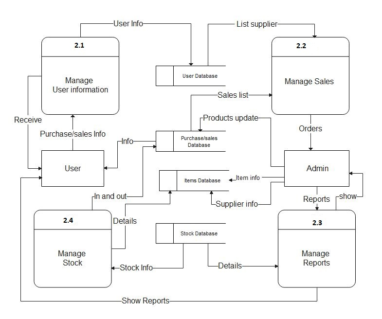

***Fig 3.1.8: DFD Diagram (level 2 DFD) for Stock Management System***

DFD Level 2 represents the
system’s specified modules as well as the data that flows between them.
These modules include the data flow, processes, external entities and
the databases. Each of them serves as the guide on how to build the
system. As we can see database i.e., user and Purchase/sales, items, and
Stock database give data to 2.1 Manage User Information, 2.2 Manage
Sales, 2.3 Manage Reports , 2.4 Manage Stock, Admin and User. User sends
Order info and gets Price info and purchase update as well Admin sends
Products update, supplier info, item info, reports, and receives
reports, list of purchase order and sales orders. User on the other hand
sends purchase and sales info and receives Reports and purchase sales
and stocks information.

## **3.2 System Design**

Considering the fact that this project involves design and
implementation of a software system regardless that is web-based, it
will be important to mention and consider some models used in software
development and deployment. System development is the process of
creating or altering systems, along with the processes, practices,
models, and methodologies used to develop them.

## **3.2.1** **Architecture Design**

In the Stock Management System, users Interact with the system through a
simple user Interface. The shopping website uses three tier
architecture. The data is collected from the users and stored in the
database through which the server provides purchase and sales details to
the user. In order to perform transaction to the user, the system uses
different database tables including different attribute for each entity.
user has a unique account number which makes them different from other
users. In this way our system architecture is designed which is an
abstract view of the system.

A three-tiered architectural design to a business system consists of the
Presentation Layer, the Business/Service Layer, and the Data Layer.
These layers are independent of each other and if need be, can run on
separate servers. Each tier is developed and maintained as independent
modules.

**Presentation Layer**

This is the entry point into a three-tiered architecture. This is the
top level of the application. It is most often referred to as the
Graphical User Interface, or GUI for short. Other terms would be client
view or front-end view. From this level, content or data is sent to
browsers in the form of JSON and transformed into HTML, JavaScript, and
CSS. Frameworks or libraries that are leveraged in rendering or
processing of this information are MVC Razor, Vue.js, React, and
Angular to name a few.

In fact, an entirely new career path for developers has been forged in
this layer. If there's one takeaway, the beginning and the end of
processing requests or data in a three-tiered application is in this
layer.

Requests are usually in the form of objects that represent data that
your application is wanting to retrieve or save. For instance, you may
be wanting to set up a new customer or you may be wanting to get
transaction history of what an existing customer has purchased through
your business or website.

Validation is also done in this layer to ensure that all required data
elements that are needed to process a request are present. If required
data elements are missing, processing the request is halted, and the
user is notified what data is missing.

**Business/Service Layer**

This layer contains logic that will take the requests or objects that
are sent from the Presentation Layer and begin to use business rules or
business logic to determine how to save or process data. Examples of
this would be the following:

- When a user places an order for a product, the system checks the
  inventory to ensure that the required quantity is available. If the
  quantity is not available, it could trigger a notification to the user
  or suggest an alternative product.

- The system could have a business rule that automatically reorders
  products when the stock level falls below a certain threshold,
  ensuring that there is always sufficient stock available.

- The system could also apply business rules related to pricing, such as
  discounts based on order quantity.

Transformation will always occur when creating, updating, or deleting
data. They are transformed or mapped to what are called Data
Transformation Objects, or DTO’s for short. These are data containers
for moving data between layers. Once transformed these objects will be
passed to the final layer, the Data Layer. Once transformed, these
objects would be passed to the data layer for saving or retrieving from
the database.

**Data Layer**

This is the final layer in the three-tiered architecture. This layer
receives the transformed objects or DTO from the Business/Service Layer
and converts them to Entity objects that represent database tables. The
main rule to follow in this layer is that there should not be any
additional business rules or logic run on the objects.

Saving of the data to your database should happen here. This is done in
the form or LINQ to SQL or stored procedures. Your data layer can
connect to a database directly to save the data or it can be passed to a
web service that will handle the saving of data.

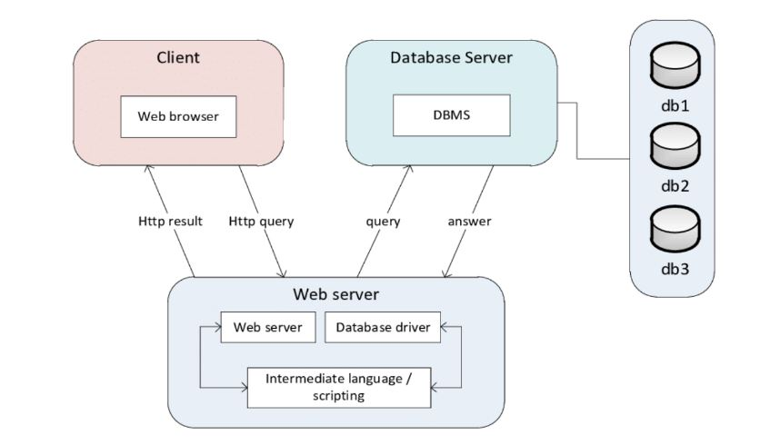

***Fig 3.2.1: 3 Tier Architecture for Stock Management System***

## **3.2.2** **Database Schema Design**

Database schema design organizes the data into separate entities,
determines how to create relationships between organized entities, and
how to apply the constraints on the data. Designers create database
schemas to give other database users a logical understanding of the
data. From the following schema we can see that Admin, Po items,
receiving lists, system info, bo items, items lists, Users, purchase
order list, back order lists, supplier lists, sales lists, return lists
and stock list. They all have relationship with each other’s and data is
stored according to the requirements by admin and user.

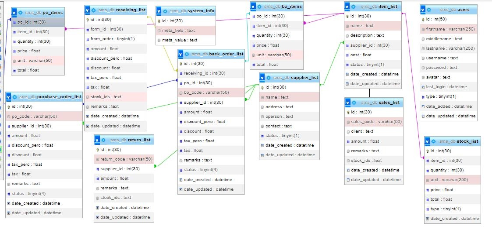

***Fig 3.2.2: Database Schema Design for Stock Management System***

## **3.2.3 Interface Design**

Before Implementing the
actual design of the, a few user interface design are constructed to
visualize user interface and interaction with the system as they browse
registration login and perform transaction. The user interface design
will closely follow our Functional Decomposition Diagram show the
initial designs of the web pages.
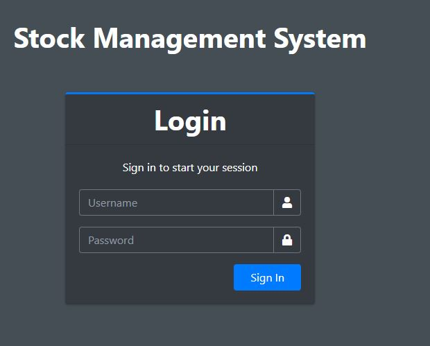

***Fig 3.2.3.1: Login Page Design for Stock Management System***
>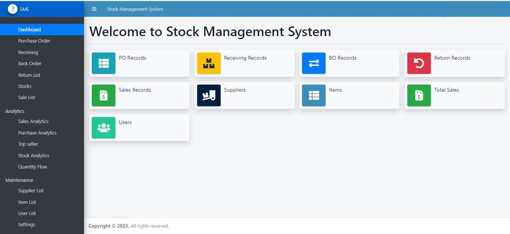 style="width:6.26806in;height:2.88194in" />

***Fig 3.2.3.2: Home Page Design for Stock Management System***
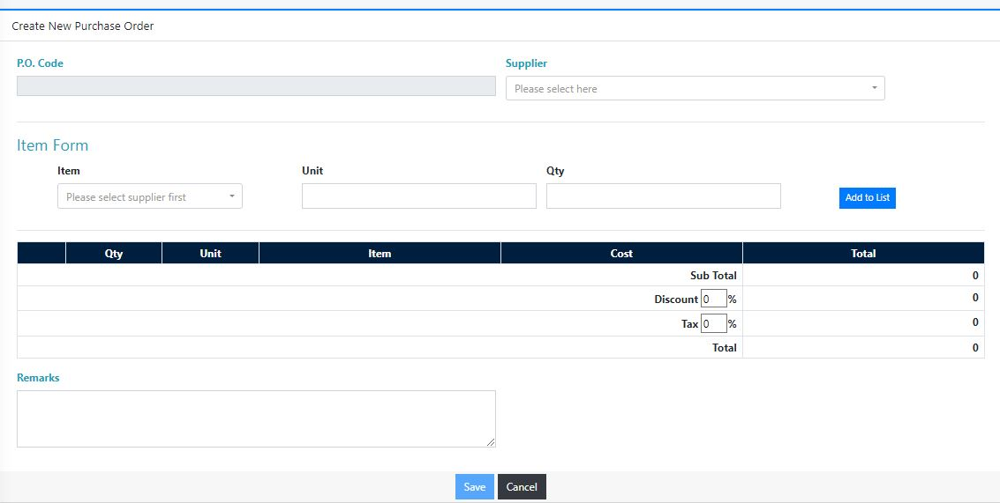

***Fig 3.2.3.3: List of Purchase Design for Stock Management System***

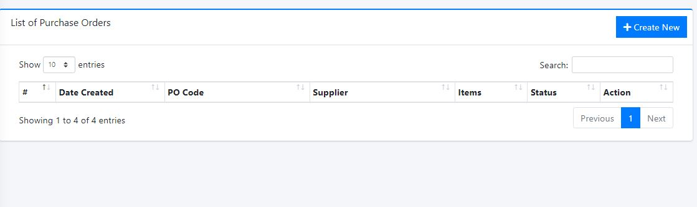

***Fig 3.2.3.4: Create New Purchase Order Design for Stock Management System***

***Fig 3.2.3.5: View Purchase Order Design for Stock Management System***

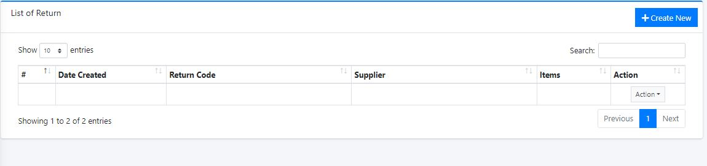

***Fig 3.2.3.6: List of Received Order Design for Stock Management System***

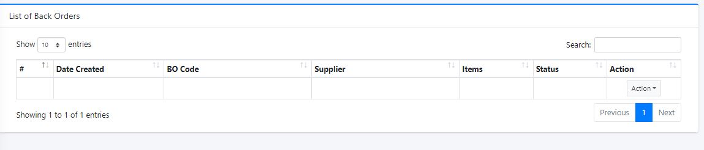

***Fig 3.2.3.7: List of Back Order Design for Stock Management System***

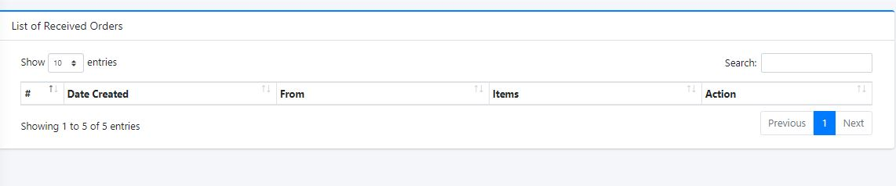 

***Fig 3.2.3.8: List of Return Order Design for Stock Management System***

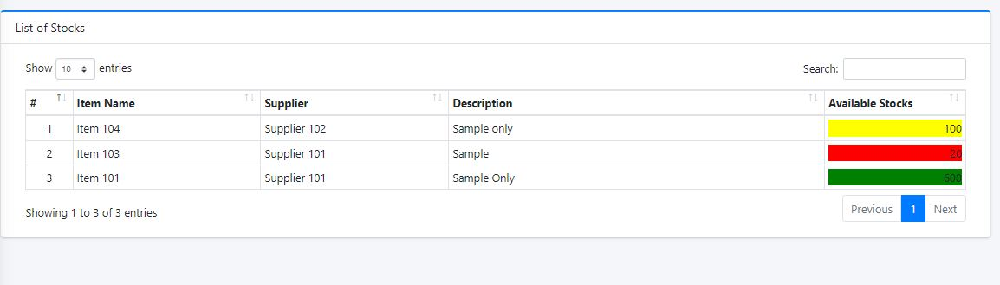

***Fig 3.2.3.9: List of Stocks Design for Stock Management System***

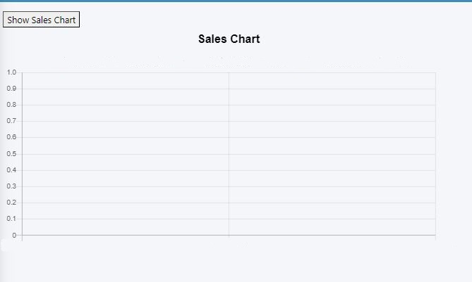

***Fig 3.2.3.10: Sales Chart Design for Stock Management System***

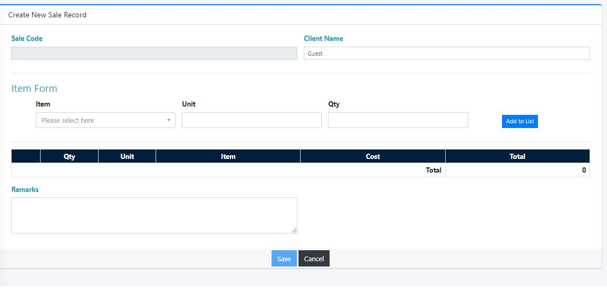 

***Fig 3.2.3.11: Create New Sale Record Design for Stock Management System***

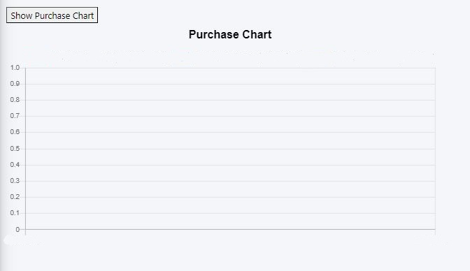

***Fig 3.2.3.12: Purchase Chart Design for Stock Management System***

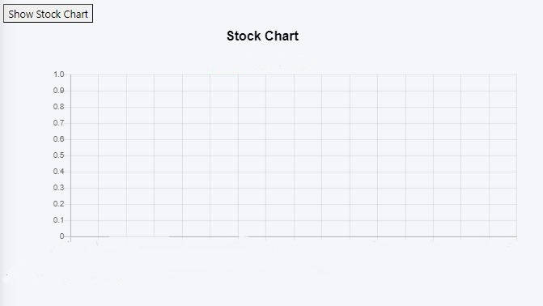

***Fig 3.2.3.13: Stock Chart Design for Stock Management System***

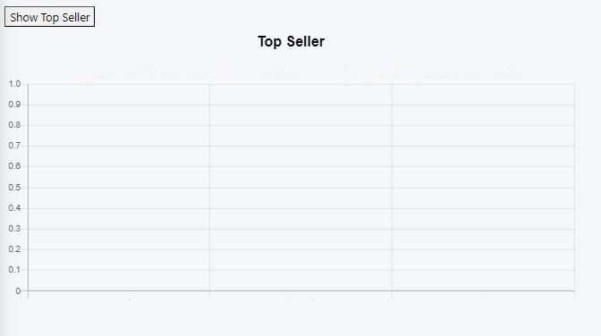

***Fig 3.2.3.14: Top Seller Chart Design for Stock Management System***

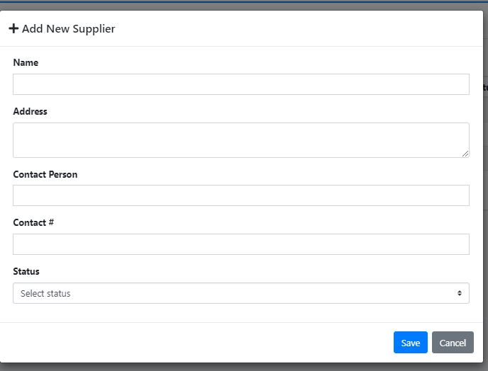

***Fig 3.2.3.15: Add New Supplier Design for Stock Management System***

## **3.2.4 Physical DFD**

In the physical data flow diagram for the stock management system, the
system is divided into four main processes: staff admin management,
purchase and sales management, supplier information management, and
analytics entity management. Each of these processes interacts with
various data stores, including the supplier, product, purchase, sales,
and record databases.

The staff admin management process includes CRUD activities for managing
staff accounts, such as creating, reading, updating, and deleting
accounts in the staff database. This process also includes the creation
and maintenance of user accounts for the purchase and sales management
process.

The purchase and sales management process includes CRUD activities for
managing purchase and sales records, as well as updating inventory
levels in the product database. This process also interacts with the
supplier database to manage product orders and shipments.

The supplier information management process includes CRUD activities for
managing supplier information, such as creating, reading, updating, and
deleting supplier records in the supplier database. This process also
includes managing product pricing and availability through interactions
with the product database.

The analytics entity management process involves collecting and
analyzing data from various sources, including the purchase and sales
records, product database, and supplier database. This process may also
include creating reports and visualizations based on the analyzed data.

Throughout the system, intermediate data stores are used to hold data
between processes, such as the transaction files used to store data
between purchase and sales management and supplier information
management. The physical data flow diagram also includes the various
CRUD activities that occur in each process and where they occur in the
system.

Overall, the physical data flow diagram provides a detailed view of how
the stock management system is constructed and how it interacts with
various data sources and external entities. This diagram can be used as
a blueprint for building and implementing the system, as well as for
troubleshooting and maintaining it in the future.

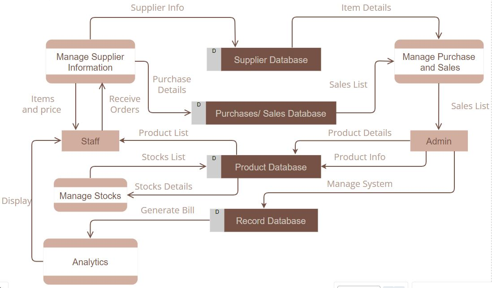

***Fig 3.2.4: Physical DFD Design for Stock Management System***

## **3.3 Algorithm**

## **3.3.1 Algorithm for Sales Analytics Page**

1\. Execute the query "SELECT DATE(date_created) as sales_date,
SUM(amount) as total_sales FROM sales_list GROUP BY DATE(date_created)
ORDER BY SUM(amount) DESC, DATE(date_created) ASC" using prepared
statements and fetch the result.

2\. Create an empty array \`\$sales_data_all_time\` to store the sales
data.

3\. Iterate over the result using a \`while\` loop:

- Assign the \`total_sales\` value to \`\$sales_data_all_time\` with the
  \`sales_date\` as the key.

4\. Calculate the total sales for all time:

- Use \`array_reduce()\` on \`\$sales_data_all_time\` to sum up all the
  sales values.

5\. Calculate the all-time high and low sales:

- Use \`max()\` and \`min()\` functions on \`\$sales_data_all_time\` to
  find the maximum and minimum values.

6\. Sort the sales data array in descending order by key using
\`krsort()\`.

7\. Get the latest month's sales data:

- Assign the first key of \`\$sales_data_all_time\` to
  \`\$current_month_date\`.

- Retrieve the sales amount for the \`\$current_month_date\`.

8\. Calculate the average sales for all time:

- Divide the total sales by the number of entries in
  \`\$sales_data_all_time\`.

9\. Calculate the current year's sales:

- Initialize \`\$current_year_sales\` to zero.

- Iterate over \`\$sales_data_all_time\`:

- Check if the first four characters of the date match the first four
  characters of \`\$current_month_date\`.

- If true, add the sales amount to \`\$current_year_sales\`.

- If false, break the loop.

10\. Generate a suggestion based on the sales data:

- Initialize \`\$suggestion\` as an empty string.

- Use conditional statements to determine the suggestion based on the
  comparisons between sales values.

- Set \`\$suggestion\` accordingly.

11\. Generate a sales message:

- Create the \`\$sales_message\` string by concatenating various
  sales-related information and the suggestion.

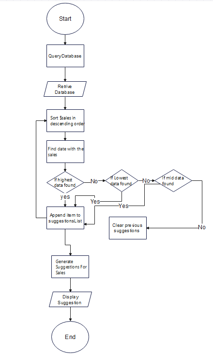12. Output the sales message

***Fig 3.3.1: Flow Chart of Sales Analytics Page for Stock Management System***

## **3.3.2 Algorithm for Purchase Analytics Page**

1\. Execute the query "SELECT DATE(date_created) as purchase_date,
SUM(amount) as total_purchase FROM \`purchase_order_list\` GROUP BY
DATE(date_created) ORDER BY SUM(amount) DESC, DATE(date_created) ASC"
using prepared statements and fetch the result.

2\. Create an empty array \`\$purchase_data_all_time\` to store the
purchase data.

3\. Iterate over the result using a \`while\` loop:

- Assign the \`total_purchase\` value to \`\$purchase_data_all_time\`
  with the \`purchase_date\` as the key.

4\. Calculate the total purchase for all time:

- Use \`array_reduce()\` on \`\$purchase_data_all_time\` to sum up all
  the purchase values.

5\. Calculate the all-time high and low purchases:

- Use \`max()\` and \`min()\` functions on \`\$purchase_data_all_time\`
  to find the maximum and minimum values.

6\. Sort the purchase data array in descending order by key using
\`krsort()\`.

7\. Get the latest month's purchase data:

- Assign the first key of \`\$purchase_data_all_time\` to
  \`\$current_month_date\`.

- Retrieve the purchase amount for the \`\$current_month_date\`.

8\. Calculate the average purchase for all time:

- Divide the total purchase by the number of entries in
  \`\$purchase_data_all_time\`.

9\. Calculate the current year's purchase:

- Initialize \`\$current_year_purchase\` to zero.

- Iterate over \`\$purchase_data_all_time\`:

- Check if the first four characters of the date match the first four
  characters of \`\$current_month_date\`.

- If true, add the purchase amount to \`\$current_year_purchase\`.

- If false, break the loop.

10\. Generate a suggestion based on the purchase data:

- Initialize \`\$suggestion\` as an empty string.

- Use conditional statements to determine the suggestion based on the
  comparisons between purchase values.

- Set \`\$suggestion\` accordingly.

11\. Generate a purchase message:

- Create the \`\$purchase_message\` string by concatenating various
  purchase-related information and the suggestion.

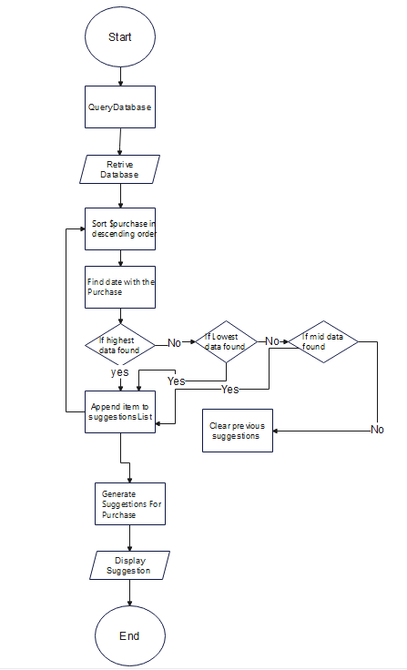12. Output the purchase
message.

***Fig 3.3.2: Flow Chart of Purchase Analytics Page for Stock Management System***

## **3.3.3 Algorithm for Top Seller Page**

1.  Initialize variables:

    - \$max_sales_this_year to 0 (maximum sales this year)

    - \$max_sales_all_time to 0 (maximum sales of all time)

    - \$min_sales_this_year to PHP_INT_MAX (minimum sales this year)

    - \$min_sales_all_time to PHP_INT_MAX (minimum sales of all time)

    - \$total_sales to 0 (total sales)

2.  Iterate over the \$sales_data_all_time array using a foreach loop,
    with each iteration represented by the variable \$data:

    - Increment \$total_sales by adding the current
      \$data\ 'total_sales' to it.

    - Initialize \$total_sales_this_year to 0 (total sales for the
      current year).

    - Initialize \$total_sales_all_time to \$data\'total_sales'
      (total sales of all time for the current client).

    - Iterate over the \$sales_data_this_year array using a nested
      foreach loop, with each iteration represented by the variable \$d:

      - Check if the current client (\$data\'client') matches the
        client in \$d\'client'.

      - If they match, assign \$d\'total_sales' to
        \$total_sales_this_year and break out of the loop.

    - Compare and update the following variables if necessary:

      - \$max_sales_this_year and \$max_sales_this_year_client if
        \$total_sales_this_year is greater than \$max_sales_this_year.

      - \$max_sales_all_time and \$max_sales_all_time_client if
        \$total_sales_all_time is greater than \$max_sales_all_time.

      - \$min_sales_this_year and \$min_sales_this_year_client if
        \$total_sales_this_year is less than \$min_sales_this_year.

      - \$min_sales_all_time and \$min_sales_all_time_client if
        \$total_sales_all_time is less than \$min_sales_all_time.

3.  Initialize variables for finding the person closest to the median
    sales:

    - \$middle_sales_person to an empty string.

    - \$middle_sales_diff to PHP_INT_MAX (difference from the median
      sales).

    - Iterate over the \$sales_data_all_time array using a new foreach
      loop, with each iteration represented by the variable \$data:

      - Initialize \$total_sales_this_year and \$total_sales_all_time as
        done in step 2.

      - Calculate the absolute difference between \$total_sales_all_time
        and half of \$total_sales and assign it to \$diff.

      - Update \$middle_sales_diff, \$middle_sales_person, and
        \$middle_sales_total if \$diff is less than \$middle_sales_diff.

4.  Output the following statements within  elements:

    - The client with the highest sales this year:
      \$max_sales_this_year_client with total sales of
      \$max_sales_this_year.

    - The client with the highest sales of all time:
      \$max_sales_all_time_client with total sales of
      \$max_sales_all_time.

    - The client with the lowest sales this year:
      \$min_sales_this_year_client with total sales of
      \$min_sales_this_year.

    - The client with the lowest sales of all time:
      \$min_sales_all_time_client with total sales of
      \$min_sales_all_time.

    - The amount \$min_sales_this_year_client needs to increase sales by
      to catch up to \$max_sales_this_year_client this year.

    - The amount \$min_sales_all_time_client needs to increase sales by
      to catch up to \$max_sales_all_time_client in total sales.

    - The person closest to the median sales: \$middle_sales_person with
      total sales of \$middle_sales_total.

5.  Output a  element with the text "Sales Summary:".

6.  Output an unordered list  and iterate over the
    \$sales_data_all_time array using a foreach loop:

    - Output each client's name ('client') and their
      corresponding total sales ('total_sales') within a list
      item 

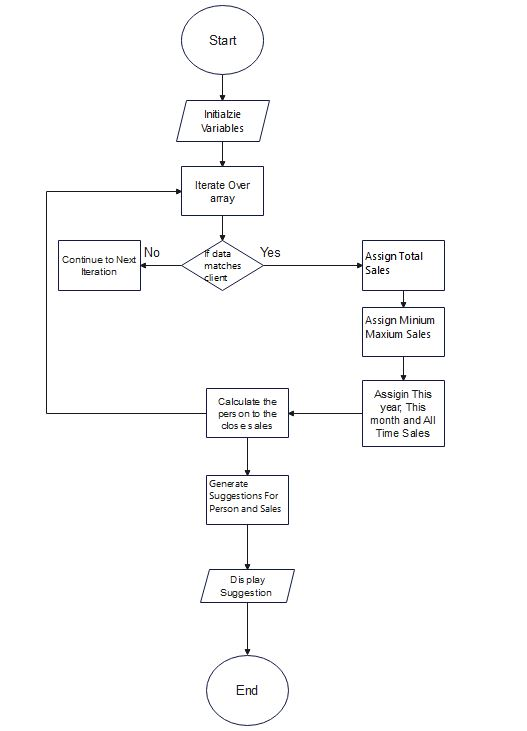

***Fig 3.3.3: Flow Chart of Top Seller Page for Stock Management System***

## **3.3.4 Algorithm for Stock Analytics Page**

1\. Retrieve stock data from the database:

- Execute the query "SELECT date_created, quantity FROM stock_list"
  using \`\$conn-\>query()\`.

- Initialize an empty array \`\$stock_data\`.

- Iterate over the result using a \`while\` loop:

- Fetch each row and add it to the \`\$stock_data\` array.

2\. Sort the stock data by quantity in descending order:

- Create a JavaScript variable \`sortedData\` and assign the
  JSON-encoded \`\$stock_data\` using \`\<?php echo
  json_encode(\$stock_data); ?\>\`.

- Sort the \`sortedData\` array using the \`sort()\` method with a
  comparison function that compares the \`quantity\` property of each
  object in descending order.

3\. Find the dates with the highest, lowest, and mid-level stock:

- Assign the \`date_created\` property of the first element in
  \`sortedData\` to the variable \`highestStockDate\`.

- Assign the \`date_created\` property of the last element in
  \`sortedData\` to the variable \`lowestStockDate\`.

- Calculate the index of the mid-level stock by dividing the length of
  \`sortedData\` by 2 and rounding it to the nearest whole number.
  Assign the \`date_created\` property of the element at the calculated
  index to the variable \`midStockDate\`.

4\. Generate a list of stock suggestions:

- Get the reference to the HTML element with the ID "suggestions-list"
  and assign it to the variable \`suggestionsList\`.

- Clear the previous suggestions in the list by setting
  \`suggestionsList.innerHTML\` to an empty string.

- Create three list items (\`\<li\>\`) and append them to
  \`suggestionsList\`:

- Set the text content of \`listItem1\` to the suggestion for reducing
  stock on the \`highestStockDate\`.

- Set the text content of \`listItem2\` to the suggestion for ordering
  more stock on the \`lowestStockDate\`.

- Set the text content of \`listItem3\` to the suggestion for restocking
  on the \`midStockDate\`.

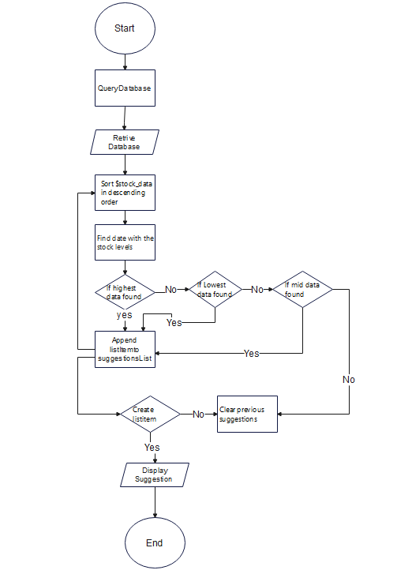

***Fig 3.3.4: Flow Chart of Stock Analytics Page for Stock Management System***

## **3.3.5 Algorithm for Quantity Flow Page**

1\. Retrieve stock data from the database:

- Execute the query "SELECT date_created, quantity FROM stock_list"
  using \`\$conn-\>query()\`.

- Initialize an empty array \`\$stock_data\`.

- Iterate over the result using a \`while\` loop:

- Fetch each row and add it to the \`\$stock_data\` array.

2\. Retrieve purchase data from the database:

- Execute the query "SELECT item_id, SUM(quantity) as total_quantity
  FROM po_items GROUP BY item_id" using \`\$conn-\>query()\`.

- Initialize an empty array \`\$purchase_data\`.

- Iterate over the result using a \`while\` loop:

- Fetch each row and add it to the \`\$purchase_data\` array.

3\. Sort the stock data by quantity in descending order:

- Create a JavaScript variable \`sortedStockData\` and assign the
  JSON-encoded \`\$stock_data\` using \`\<?php echo
  json_encode(\$stock_data); ?\>\`.

- Sort the \`sortedStockData\` array using the \`sort()\` method with a
  comparison function that compares the \`quantity\` property of each
  object in descending order.

4\. Find the dates with the highest, lowest, and mid-level stock:

- Assign the \`date_created\` property of the first element in
  \`sortedStockData\` to the variable \`highestStockDate\`.

- Assign the \`date_created\` property of the last element in
  \`sortedStockData\` to the variable \`lowestStockDate\`.

- Calculate the index of the mid-level stock by dividing the length of
  \`sortedStockData\` by 2 and rounding it to the nearest whole number.
  Assign the \`date_created\` property of the element at the calculated
  index to the variable \`midStockDate\`.

5\. Generate a list of stock suggestions:

- Get the reference to the HTML element with the ID "suggestions-list"
  and assign it to the variable \`suggestionsList\`.

- Clear the previous suggestions in the list by setting
  \`suggestionsList.innerHTML\` to an empty string.

- Create three list items (\`\<li\>\`) and append them to
  \`suggestionsList\`:

- Set the text content of \`listItem1\` to the suggestion for reducing
  stock on the highestStockDate.

<!-- -->

- Set the text content of \`listItem2\` to the suggestion for ordering
  more stock on the lowestStockDate.

- Set the text content of \`listItem3\` to the suggestion for restocking
  on the midStockDate.

6\. Add a purchase suggestion:

- Create a JavaScript variable \`sortedPurchaseData\` and assign the
  JSON-encoded \`\$purchase_data\` using \`\<?php echo
  json_encode(\$purchase_data); ?\>\`.

- Sort the \`sortedPurchaseData\` array by the \`total_quantity\`
  property in descending order.

- Create a list item (\`\<li\>\`) \`purchaseSuggestion\` and set its
  text content to the suggestion for purchasing less of the item with
  the highest total quantity.

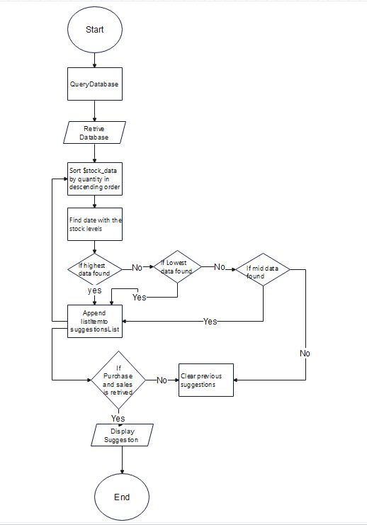

***Fig 3.3.4: Flow Chart of Quantity Flow Page for Stock Management System***

# CHAPTER 4: IMPLEMENTATION AND TESTING

## **4.1 Implementation**

Implementation basically means the phase where the system is actually
being built. Firstly, all the information that we gathered is studied
and analysed and implemented a system in operation for users. It is one
of the most important phases of any project. Implementation usually
consists of coding; testing, installation, documentation, training and
support. Different tools and technologies that have been used to develop
the system which are already discuss in the previous chapter. It is
basically converting system design specification into working software.

## **4.1.1 Tools Used**

The various system tools that have been used in developing both the
front-end and backend of the project are being discussed in this
chapter.

**Front-end**

Bootstrap, HTML, CSS, and JavaScript are used for developing the
front-end.

- **HTML (Hyper Text Markup Language):** HTML means Hypertext Markup
  Language. This language is used in creating web pages. This language
  also supports other languages such CSS, PHP, JAVASCRIPT, etc. in
  creating interactive and responsive pages on the pages. HTML is used
  in this project as front-end and with the help of HTML Login Page,
  Home Page, Purchase order Page, Back order Page, Return Order Page,
  Receive Order Page, Sales Order Page, Supplier Page, Analytics Page
  and Suppler Page.

- **CSS (Cascading Style Sheets):** CSS is a style sheet language used
  for describing the look and formatting of a document written in a
  markup language.CSS is used to define styles for web pages, including
  the design, layout, and variations in the display for different
  devices and screen sizes. CSS is used as front-end and with the help
  of CSS designing text and adding colours in text and Inline CSS is
  used as managing page design and font.

- **Java script:** Java Script is a dynamic computer programming
  language. It is most commonly used as part of web browsers, whose
  implementations allow client-side scripts to interact with the user,
  control the browser, communicate asynchronously, and alter the
  document content that is displayed. Java Script is used to create
  popup windows displaying different alerts in the system like "Login
  successful", "Invalid Username/ Invalid Password ", and for various
  Validation and Verification Messages.

- **Bootstrap:** It includes HTML and CSS based design templates for
  typography, forms, buttons, tables, navigation, modals, image etc. It
  also gives support for JavaScript plugins. design and customize
  responsive sites with Bootstrap, most popular front-end open-source
  toolkit, featuring Sass variables. Bootstrap helps to quickly and
  easily design the webpages.

**Back-end**

The back-end is implemented using PHP and MySQL is used to design the
database.

- **PHP:** PHP is used as Back-end in this project. The PHP is used for
  server-side processing on the web server. PHP is a set of components
  that provide developers with a framework to implement complex
  functionality. PHP provides state services that can be utilized to
  manage session variables across multiple Web servers in a server form.
  The programming language used in development of project is PHP.

- **MySQL:** MySQL is one of the leading database management systems
  available on the market today. In this data is stored in the form of
  tables which can be created and manipulated by using various commands.
  The database itself has been redesigned to automatically perform many
  tuning functions, leaving you free to focus on most important tasks.

## **4.1.2 Implementation Details of Modules**

After the design was made and the problems arising from the design
process were clarified and dealt with, it was time to start implementing
the application. Implementing application of this scale requires lots of
resources and explaining the whole implantation process will not be
clarified in this paper. However major important aspects in the
implementation will be described. Some modules of the stock management
system are listed below:

- Header: It displays the header with the logo of the Stock management
  system website, or the login. It is used in the navbar of the
  homepage. It is used in order to provide links to different pages of
  the website.

- Login Form: It is used in order to provide the user the gateway to the
  website. It uses the data like username and password from register
  form to authenticate the user and give further access.

- Home Page: This would serve as the main page of the application. It
  would display an overview of the system, including key performance
  indicators, such as inventory levels, sales, and purchases.

- Purchase Order Page: This page would allow users to create purchase
  orders for products. It would include a form for entering details
  about the purchase, such as the supplier, the products being ordered,
  and the quantity.

- Back Order Page: This page would allow users to create back orders for
  products that are out of stock. It would include a form for entering
  details about the back order, such as the supplier, the products being
  ordered, and the quantity.

- Return Order Page: This page would allow users to initiate return
  orders for products that are defective or not as described. It would
  include a form for entering details about the return, such as the
  product being returned and the reason for the return.

- Receive Order Page: This page would allow users to receive and record
  deliveries of products from suppliers. It would include a form for
  entering details about the delivery, such as the supplier, the
  products received, and the quantity.

- Sales Order Page: This page would allow users to create sales orders
  for products. It would include a form for entering details about the
  sale, such as the customer, the products being sold, and the quantity.

- Supplier Page: This page would allow users to manage supplier
  information, such as adding new suppliers, updating supplier details,
  and deleting suppliers.

- Analytics Page: This page would allow users to view analytics and
  reports about the system, such as sales trends, inventory levels, and
  supplier performance.

The implementation process would involve the development of these
modules and the integration of the different components to create a
cohesive system. Testing and debugging would also be necessary to ensure
that the system works as intended.

## **4.2 Testing**

Testing is done to check the behaviour of a complete and fully
integrated software product based on the software requirement
specification document. For the application or website to be deployed it
has to be tested. Hence test cases will be written to test this
application. They are many types of tests to be carried out on a web
application from performance, functionality, database loading time,
response time, server time handling, user's actions and many others. We
will not carry out all types of tests for the application considering
the time scale to present this project Hence performance check related
to upload time, memory usage will be part of a future test. We will
focus the test cases on functionality, security and performance. So that
various types of testing procedures were performed in order to check the
working mechanism and correctness of the system. Some of the types of
testing that we did are described below:

1.  Login Page:

- Verify that valid credentials allow the user to log in.

- Verify that invalid credentials result in an error message.

2.  Home Page:

- Verify that all the links and buttons on the home page work as
  expected.

- Verify that the navigation menu is correctly displayed and functional.

3.  Purchase Order Page:

- Verify that the page allows the user to create a new purchase order.

- Verify that the user can add products to the purchase order.

- Verify that the purchase order is saved correctly in the database.

- Verify that the user can edit and delete the purchase order.

4.  Back Order Page:

- Verify that the page allows the user to create a new back order.

- Verify that the user can add products to the back order.

- Verify that the back order is saved correctly in the database.

- Verify that the user can edit and delete the back order.

5.  Return Order Page:

- Verify that the page allows the user to create a new return order.

- Verify that the user can add products to the return order.

- Verify that the return order is saved correctly in the database.

- Verify that the user can edit and delete the return order.

6.  Receive Order Page:

- Verify that the page allows the user to receive products from a
  purchase order.

- Verify that the user can update the inventory levels.

- Verify that the received products are saved correctly in the database.

7.  Sales Order Page:

- Verify that the page allows the user to create a new sales order.

- Verify that the user can add products to the sales order.

- Verify that the sales order is saved correctly in the database.

- Verify that the user can edit and delete the sales order.

8.  Supplier Page:

- Verify that the page displays a list of all the suppliers.

- Verify that the user can add, edit, and delete suppliers.

- Verify that the supplier details are saved correctly in the database.

9.  Analytics Page:

- Verify that the page displays the relevant data in a meaningful way.

- Verify that the graphs and charts are accurate and up-to-date.

- Verify that the user can filter and sort the data as needed.

## **4.2.1 Test Case for Unit Testing**

| **S.No** | **Test Case Description**                                         | **Test Data**                                    | **Expected Result**                          | **Actual Result**                            | **Pass/Fail** |
|----------|-------------------------------------------------------------------|--------------------------------------------------|----------------------------------------------|----------------------------------------------|---------------|
| 1        | Verify that the login page loads correctly                        | N/A                                              | Login page is displayed                      | Login page is displayed                      | Pass          |
| 2        | Verify that valid credentials allow the user to log in            | Username:admin, Password: admin123               | User is logged in                            | User is logged in                            | Pass          |
| 3        | Verify that invalid credentials result in an error message        | Username: invaliduser, Password: invalidpassword | Error message is displayed                   | Error message is displayed                   | Pass          |
| 4        | Verify that the purchase order page loads correctly               | N/A                                              | Purchase order page is displayed             | Purchase order page is displayed             | Pass          |
| 5        | Verify that the user can add products to the purchase order       | Product: Widget, Quantity: 10                    | Product is added to the purchase order       | Product is added to the purchase order       | Pass          |
| 6        | Verify that the purchase order is saved correctly in the database | Purchase order details                           | Purchase order is saved in the database      | Purchase order is saved in the database      | Pass          |
| 7        | Verify that the user can edit and delete the purchase order       | Purchase order ID: 123, New quantity: 20         | Purchase order is updated in the database    | Purchase order is updated in the database    | Pass          |
| 8        | Verify that the supplier page loads correctly                     | N/A                                              | Supplier page is displayed                   | Supplier page is displayed                   | Pass          |
| 9        | Verify that the user can add suppliers                            | Supplier details                                 | Supplier is added to the database            | Supplier is added to the database            | Pass          |
| 10       | Verify that the user can edit and delete suppliers                | Supplier ID: 456, New address: Kathmandu\`       | Supplier details are updated in the database | Supplier details are updated in the database | Pass          |

## **4.2.2 Test Case for System Testing**

| **S.no** | **Test Case Description**                                                                    | **Test Data**                                                 | **Expected Result**                         | **Actual Result**                           | **Pass/Fail** |
|----------|----------------------------------------------------------------------------------------------|---------------------------------------------------------------|---------------------------------------------|---------------------------------------------|---------------|
| 1        | Verify that valid credentials allow the user to log in                                       | Username: testuser, Password: testpassword                    | User is logged in                           | User is logged in                           | Pass          |
| 2        | Verify that invalid credentials result in an error message                                   | Username: invaliduser, Password: invalidpassword              | Error message is displayed                  | Error message is displayed                  | Pass          |
| 3        | Verify that all the links and buttons on the home page work as expected                      | N/A                                                           | Links and buttons work as expected          | Links and buttons work as expected          | Pass          |
| 4        | Verify that the navigation menu is correctly displayed and functional                        | N/A                                                           | Navigation menu is displayed and functional | Navigation menu is displayed and functional | Pass          |
| 5        | Verify that the purchase order page allows the user to create a new purchase order           | Supplier: ABC Company,s Product: Item2, Quantity: 10          | Purchase order is created                   | Purchase order is created                   | Pass          |
| 6        | Verify that the back order page allows the user to create a new back order                   | Supplier: XYZ Company, Product:Itme1, Quantity: 5             | Back order is created                       | Back order is created                       | Pass          |
| 7        | Verify that the return order page allows the user to create a new return order               | Customer: Milan Karki, Product: Defective Widget, Quantity: 1 | Return order is created                     | Return order is created                     | Pass          |
| 8        | Verify that the receive order page allows the user to receive products from a purchase order | N/A                                                           | Return order page allows to receive         | Return order page allows to receive         | Pass          |
| 9       | Verify that a new supplier can be added.                  | Name: ABC Supplier | A new supplier is added to the database with the provided details.                                             | A new supplier is added to the database with the provided details.                                            | Pass          |
| 10      | Verify that a supplier can be edited.                     | Supplier ID: 123   | The supplier's details are updated with the new information.                                                   | The supplier's details are updated with the new information                                                   | Pass          |
| 11      | Verify that a supplier can be deleted.                    | Supplier ID: 456   | The supplier is removed from the database.                                                                     | The supplier is removed from the database                                                                     | Pass          |
| 12      | Verify that the list of suppliers is displayed correctly. | N/A                | The page displays a table of all the suppliers in the database, with their details listed in separate columns. | The page displays a table of all the suppliers in the database, with their details listed in separate columns | Pass          |

# CHAPTER 5: CONCLUSION AND FUTURE RECOMMENDATION

## **5.1. Conclusion**

In conclusion, we have developed a comprehensive Stock Management System
that incorporates all the necessary functionalities for efficient stock
management. The system has been developed using PHP, MySQL, HTML, and
CSS technology, which allows for easy manipulation and handling of large
amounts of data. The system has been designed to cater to the needs of
both administrators and users, with features such as purchase order
creation, order approval, backorder display, return list creation, sales
list creation, and stock monitoring.

Additionally, the system generates bills in Printable, PDF, and Excel
formats for easy record keeping. The analytics section of the system
provides users with a clear overview of the sales analytics, purchase
analytics, top seller, stocks quantity analytics, and quantity flow.
With the completion of this project, we are confident that this system
will be useful in managing stock effectively and efficiently is saved in
the database

Choosing PHP for this project is because it is very simple and easy to
use, it could handle a lot of data and easily manipulation compared to
another scripting language, this is widely used all over the world. it
is Open source, we can freely download and use. And it is platform
independent as well.

As complementing the end of the project, we realized that there are many
enhancements that can be made on the application. Some of these ideas
came from those who tested the application following the specification
because they were realistic to achieve in this given amount of time. Any
other enhancements to the application can be done in future development
of the application.

## **5.2. Outcome**

When this project is completed, we developed Stock Management System
with Proper Functionality, Validation and verification. In this System
the Admin and Users will be able to login in the system, Create Purchase
Order, Approve Orders, If the Orders are Partially approved then the not
Approved order will be Displayed in Backorder, and will also be able to
Create Return List then list will be added to the remaining stocks, and
the Admin and Users will also be able to create Sales list and will be
able to See the Remaining Stocks. The System will also generate the bill
in printable format, PDF format and Excel format. Admin will only have
the privileges to create and add Suppliers and Items in the system. The
User and Admin will Both Be able to see the Analytics Part in the
system. The analytics part will cover the Sales analytics, Purchase
analytics, Top seller, Stocks Quantity analytics, and Quantity Flow in
the system.

## **5.3. Future Recommendation**

Here is what can be added in the future on this website to increase its
usability, user experience and portability of the website. There is a
lot to be done hence this application can be considered as a starting
point for something big to come. It will need more time and resources
for all these to be done but it is still very realistic and possible to
achieve.

The stock management system has been designed and developed to meet the
current needs of our business. However, there are still many
opportunities for improvement and enhancement. Here are some future
recommendations:

- Integration with barcode scanners.

- Integration with automated re-ordering systems.

- Advanced analytics and reporting.

- Integration with ecommerce platforms.

- Mobile app

Overall, the stock management system has the potential to become a
powerful tool for managing inventory, sales, and suppliers. By
implementing these enhancements, we can ensure that our business is
always operating at peak efficiency and profitability.

# REFERENCES

1. https://www.techtarget.com/searchcio/definition/stock.

2. https://erdplus.com/standalone. 

3. Ramesh singh saudh , System Analysis and Design, Ktm: KEC
Publication, 2020 (Revised).

4. Ramesh singh saudh , Software Engineering, Ktm: KEC Publication, 2020(Revised).

5. Alexandre de Castro Moura and Alessandra Angelucci, "A System for Stock Management of Clothing Retail Companies," Procedia Manufacturing, Vol. 39, pp. 545-554, 2019.

6. G. H. Hashmi, M. H. Jamil, and A. I. Sheikh, "Development of an Automated Inventory Management System using RFID," International Journal of Advanced Computer Science and Applications, vol. 8, no. 5, pp. 322-327, 2017.

7. J. A. N. Martins and J. M. F. Calado, "A Framework for Stock
Management in Small and Medium-sized Enterprises," International Journal of Production Economics, vol. 132, no. 2, pp. 294-305, 2011.
